# PNWColors   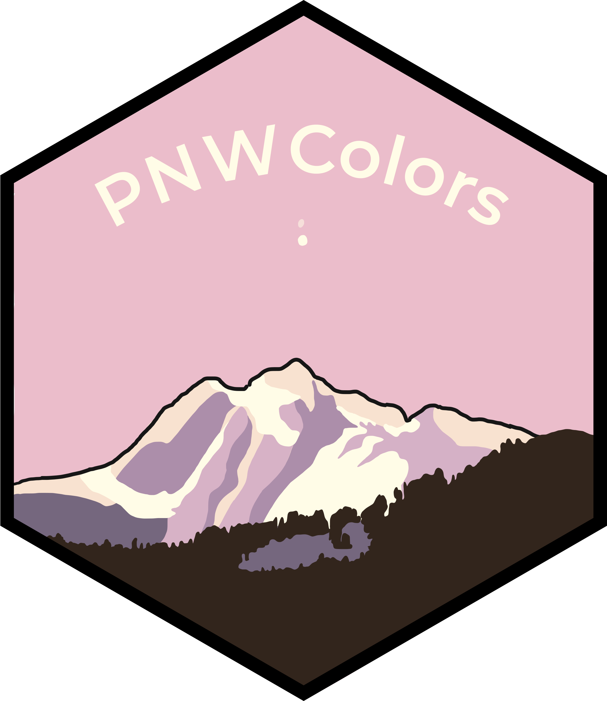


Four years spent in the most beautiful place in the world, immortalized in an R color palette package. May the colors of Washington State and the Pacific Northwest live on in our presentation figures forever. 

Palettes are pulled from photos I took in some of the dreamiest, most colorful, PNW-iest places I know. The [Pantone Studio iPhone app](https://apps.apple.com/us/app/pantone-studio/id329515634) helped me extract  colors, and 
[Chroma.js Color Palette Helper](https://gka.github.io/palettes/#/9|s|00429d,96ffea,ffffe0|ffffe0,ff005e,93003a|1|1)
helped me adjust values to ensure that all palettes are <b>color-blind safe</b> to be used for attractive and inclusive data viz.

Structure of the code was inspired by the [`wesanderson`](https://github.com/karthik/wesanderson) and [`LaCroixColoR`](https://github.com/johannesbjork/LaCroixColoR) packages. [See more examples on twitter.](https://twitter.com/Jake_Lawlor1/status/1192175651358330880)

[Installation](#install-package)  
[Palettes](#palettes)  
[Functions](#building-palettes)  
[Examples](#example-plots)  
[As Seen In](#as-seen-in)  
[Contact](#contact)  


<!-- [](https://zenodo.org/badge/latestdoi/214987774) --->


## Install Package
```r

# from CRAN
install.packages("PNWColors")

# or dev version:
install.packages("devtools") 
devtools::install_github("jakelawlor/PNWColors") 
```

## Usage


```r
library(PNWColors)

names(pnw_palettes)
 [1] "Starfish" "Shuksan"  "Bay"      "Winter"   "Lake"     "Sunset"   "Shuksan2" 
 [8] "Cascades" "Sailboat" "Moth" "Spring"   "Mushroom" "Sunset2"  "Anemone"    
 ```

## Palettes


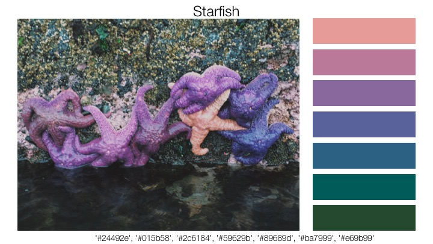

  - Low Tide -- San Juan Islands, Washington 
  
***


    
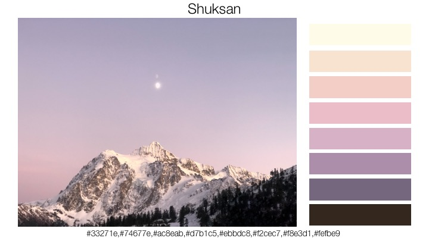

- Mount Shuksan from Mount Baker Ski Resort -- North Cascades, Washington

***


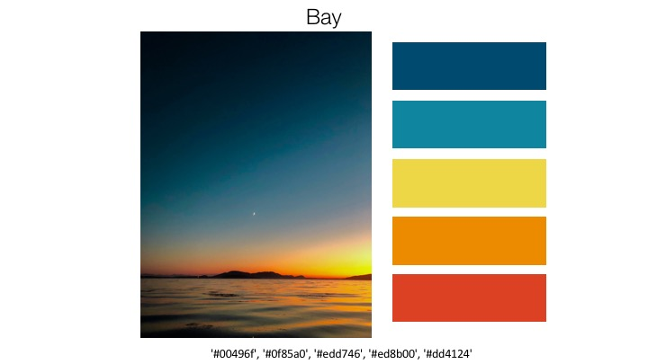


- A nice night for a late-summer sunset paddle -- Bellingham Bay, Washington

***


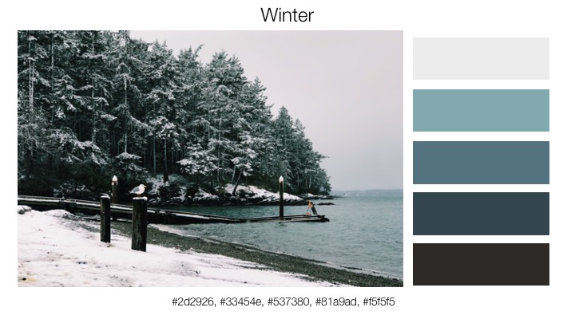

- Seattle Snowpocalypse 2019 -- Anacortes, Washington

***


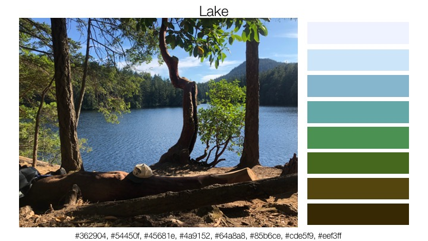

- Best after-work beer spot West of the Mississippi --  Whistle Lake, Anacortes, Washington

***


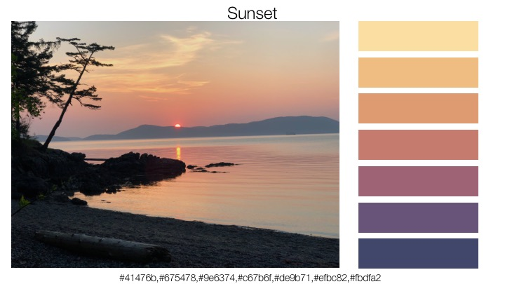

- Washington Park sunset -- Anacortes, Washington 

***


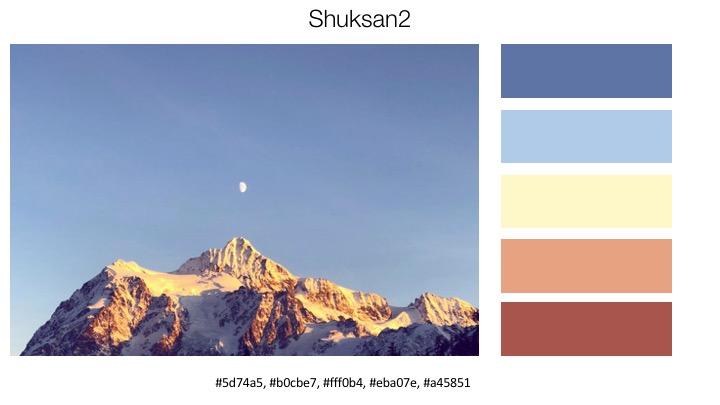

- Mount Shuksan, golden hour -- North Cascades, Washington 
***


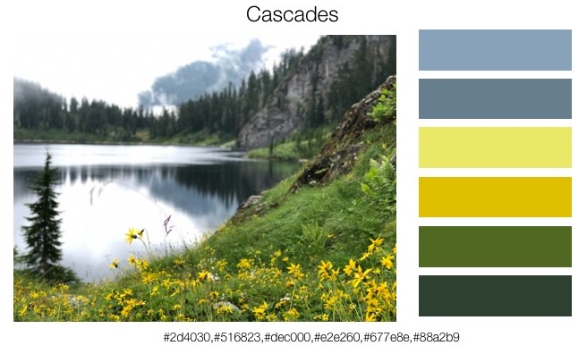

- Watson Lake Trail End -- North Cascades, Washington

***


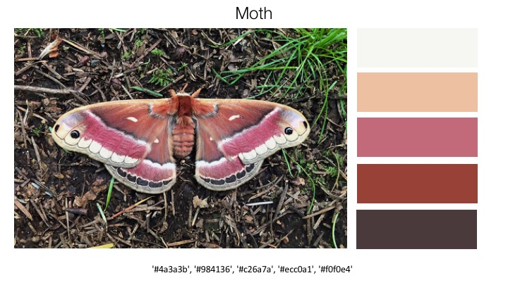

- The most beautiful moth  -- Vendovi Island, Washington

***

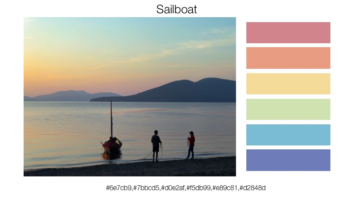

- S/V Funky Dory, the maiden voyage -- Anacortes, Washington

***


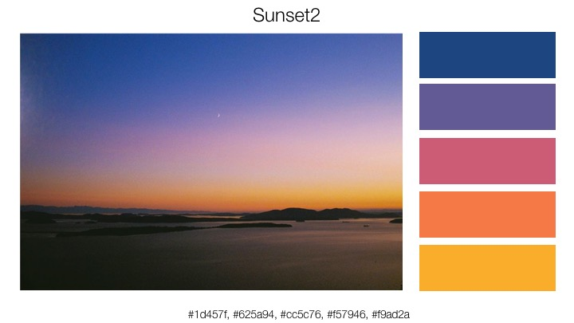

- Oyster Dome Sunset -- Chuckanut, Washington

***

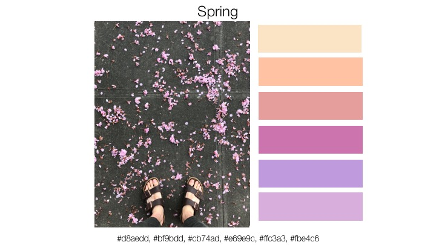

- Cherry Blossom Season -- Anacortes, Washington

***


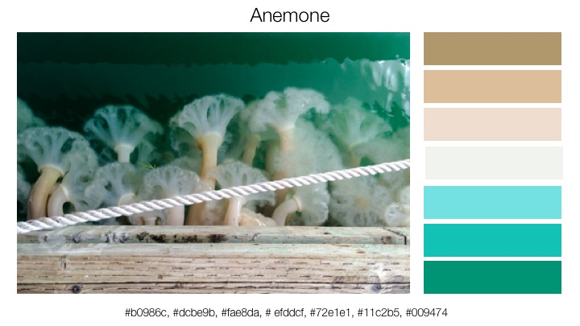

- Fieldtrip -- Anacortes, Washington 

***


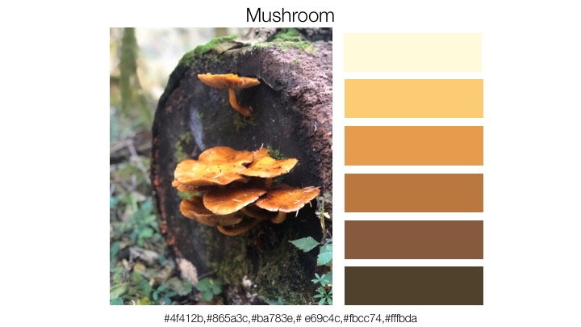

- Life on a log -- Orcas Island, Washington

***


## Building Palettes 

Use the `pnw_palette()` function to build and view palettes. Inputs are 'name', 'n', and 'type' (continuous or discrete). 'Name' is required. If 'n' is blank, function will assume n is equal to the number of colors in the palette (5-8), but if n > palette length, it will automatically interpolate colors between. If 'type' is missing, the function will assume "discrete" if n < palette length, and "continuous" if n > palette length. 

```r
pnw_palette(name="Starfish",n=7,type="discrete")
```


```r
pnw_palette("Winter",100)
```


```r
pnw_palette("Bay",8,type="continuous")
```
<center></center>


```r
pnw_palette("Moth",12)
```
<center></center>


## Example Plots

Palettes can be easily integrated into Base R imaging or `ggplot2`. 

```r
pal <- pnw_palette("Shuksan",100)
image(volcano, col = pal)
```
<center></center>


```r
pal=pnw_palette("Lake",5, type = "discrete")
ggplot(diamonds, aes(carat, fill = cut)) +
  geom_density(position = "stack") +
  scale_fill_manual(values=pal)  +
  theme_classic()
```  
<center></center>


```r
pal=pnw_palette("Shuksan2",100)
ggplot(data.frame(x = rnorm(1e4), y = rnorm(1e4)), aes(x = x, y = y)) +
  geom_hex() +
  coord_fixed() +
  scale_fill_gradientn(colours = pal) +
  theme_classic()
  
  # Or, to switch the order, use rev(), see below
  scale_fill_gradientn(colours = rev(pal))
```


<center></center>
<center></center>


```r
library(palmerpenguins)
ggplot(data = penguins, 
       aes(x = flipper_length_mm,
           y = body_mass_g)) +
  geom_point(aes(color = species, 
                 shape = species),
             size = 3) +
  scale_color_manual(values = pnw_palette("Bay",3)) +
  labs(title = "Penguin size, Palmer Station LTER",
       subtitle = "Flipper length and body mass for Adelie, Chinstrap and Gentoo Penguins",
       x = "Flipper length (mm)",
       y = "Body mass (g)",
       color = "Penguin species",
       shape = "Penguin species") +
  theme_classic()
```
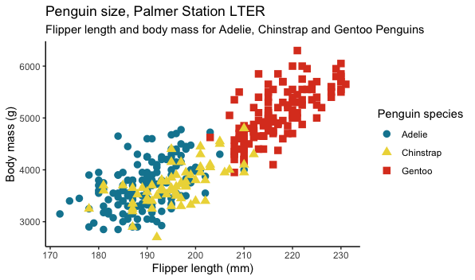


 ```r
pal <- pnw_palette("Anemone",3)
ToothGrowth$dose <- as.factor(ToothGrowth$dose)
ggplot(ToothGrowth, aes(x=dose, y=len, fill=dose)) + 
  geom_violin(trim=FALSE)+
  geom_boxplot(width=0.1, fill="white")+
  labs(title="Plot of length  by dose",x="Dose (mg)", y = "Length")+
  scale_fill_manual(values=pal)+
  theme_classic()
```
<center></center>


 ```r
library(tidyverse)
library(urbnmapr)
pal <- pnw_palette("Winter",100)
countydata %>%
  left_join(counties, by = "county_fips") %>%
  filter(state_name =="Washington") %>%
  ggplot(mapping=aes(long,lat,group = group, fill = horate)) +
  geom_polygon(color="black",size=.25) +
  scale_fill_gradientn(colours = pal) +
  coord_map(projection="albers",lat0=39,lat1=45) +
  theme(legend.title = element_text(),
        legend.key.width = unit(.5,"in")) +
  labs(fill="Homeownership rate") +
  theme_void()
  
```
<center></center>


## As Seen In:
Have you used `PNWColors` in something? Please share to grow the list! 
***
[Lawlor and Arellano 2020, Scientific Reports](https://rdcu.be/b6gkb), **Bay** palette <br>
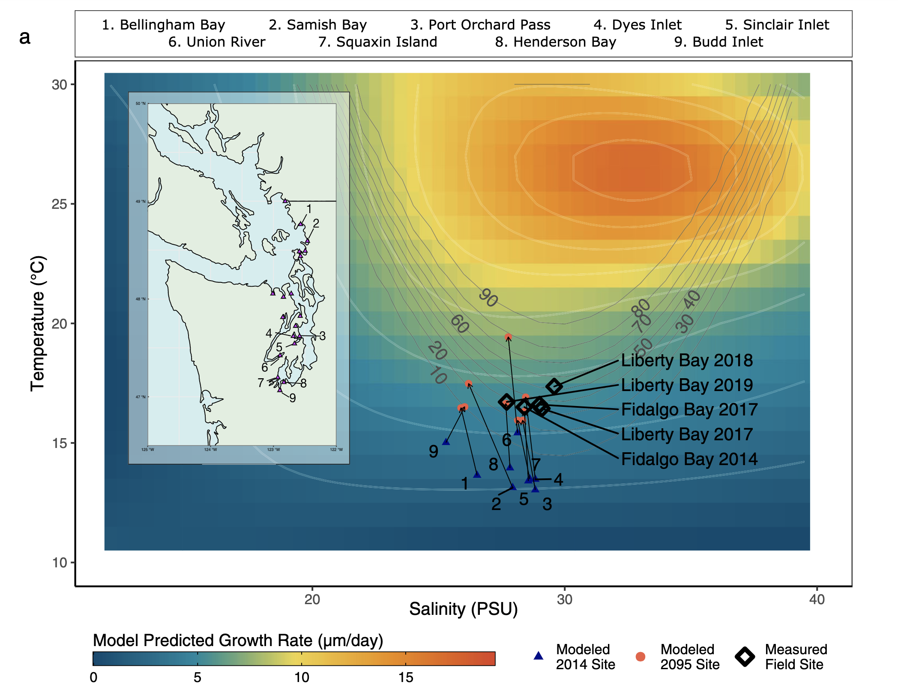
***
[Patel et al. 2020, Biogeochemistry](https://link.springer.com/article/10.1007/s10533-020-00711-5), **Sailboat** palette <br>
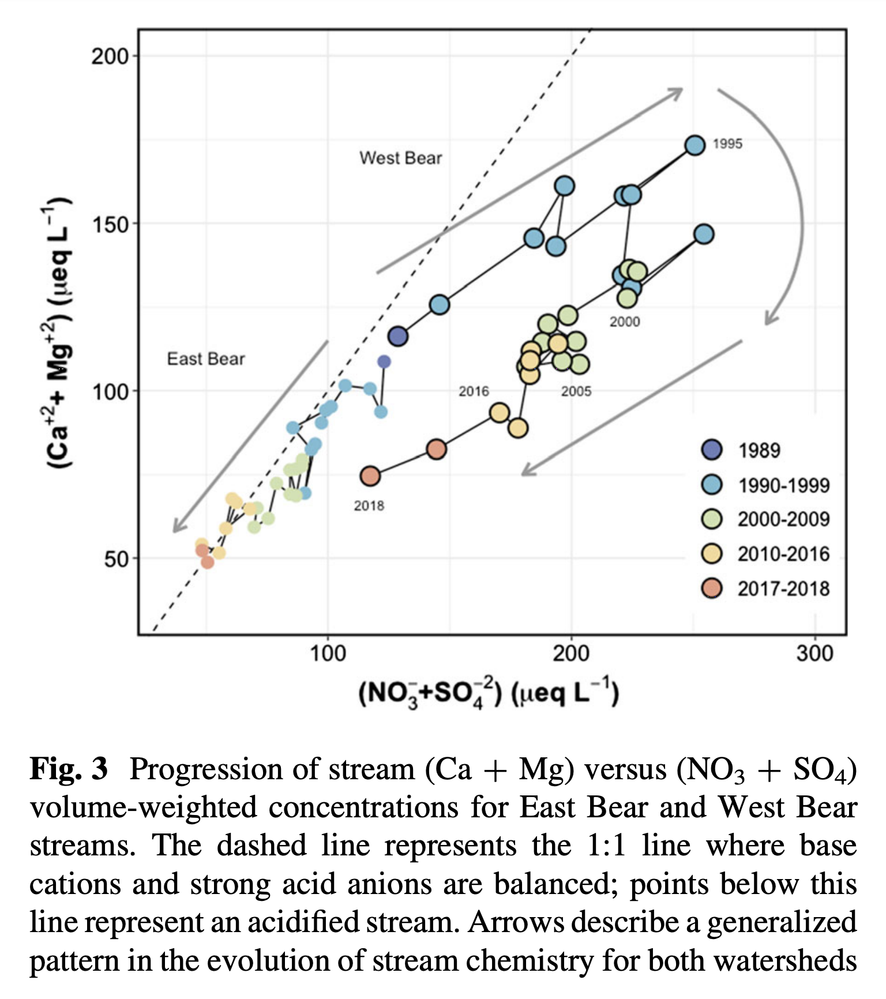
***
[Nicholas et al. 2020, Journal of Physical Chemistry C](https://pubs.acs.org/doi/10.1021/acs.jpcc.0c07268), **Sunset2** palette <br>
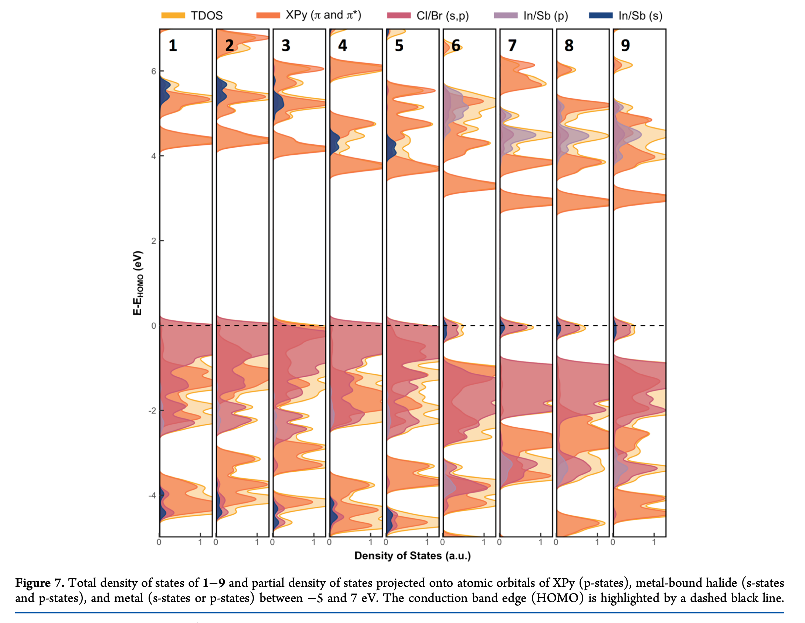

***

### Contact
Reach me at <jake.lawlor@mail.mcgill.ca> or 
[@Jake_Lawlor1](https://twitter.com/Jake_Lawlor1) 

For Citation Information, see here: [](https://zenodo.org/badge/latestdoi/214987774)


###### This work was supported by NSF grant #1538626
